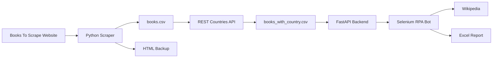

# Book Scraper Automation System

An end-to-end automation system that combines:

- Web Scraping & Crawling
- External REST API Integration
- REST API Development with FastAPI
- RPA Browser Automation with Selenium
- Automated Report Generation
- Docker Deployment
- Redis Caching


# System Overview

This project implements an automated pipeline for collecting, processing, enriching, and reporting book information.

The system workflow:

1. Scrape book information from `https://books.toscrape.com`
2. Store collected data and raw HTML backup files
3. Enrich book information with country data using REST Countries API
4. Cache external API responses using Redis
5. Provide processed data through FastAPI REST API
6. Use Selenium RPA bot to consume API data
7. Filter 5-star books, search information on Wikipedia, and generate Excel reports


# Architecture




# Features


## 1. Web Scraping

The scraper collects book information from:

```
https://books.toscrape.com
```

Collected information includes:

- Book title
- Price
- Rating
- Availability
- Product URL


The scraper also saves raw HTML pages for backup and debugging:

```
html_backup/
```


## 2. Data Enrichment

The scraped dataset is enriched with country information using:

```
REST Countries API
```

Redis is used as a caching layer to:

- Reduce repeated API requests
- Improve response time
- Avoid unnecessary external API calls


The output file:

```
books_with_country.csv
```


## 3. FastAPI REST API

The backend provides book information through REST endpoints.

API documentation:

```
http://localhost:8000/docs
```


Example endpoint:

```
GET /books
```


## 4. Selenium RPA Automation

The RPA bot performs the following tasks:

1. Consume book data from FastAPI
2. Filter books with 5-star rating
3. Search book information on Wikipedia
4. Generate an Excel report


Generated output:

```
rpa_report.xlsx
```


# Project Structure

```
book_scraper/

│
├── scraper/
│   ├── scraper.py
│
├── api/
│   ├── main.py
│   └── run.py
│
├── rpa/
│   └── bot.py
|   └── Dockerfile.py
|   └── report.xlsx
│
├── data/
│   ├── books.csv
│   └── books_with_country.csv
│
├── tests/
│
├── Dockerfile
├── .Dockerignore
├── run_add_country.sh
├── run_main.py
├── run_rpa.sh
├── run_scrapper.sh
├── requirements.txt
└── README.md
```


# Installation Guide


## 1. Clone Repository

```bash
git clone <repository-url>

cd book_scraper
```

Make sure you are inside the project folder before running commands.


## 2. Create Conda Environment

This project uses Conda for environment management.

Install Conda:

- Anaconda:
https://www.anaconda.com/download

- Miniconda:
https://docs.conda.io/projects/miniconda/en/latest/


Check Conda installation:

```bash
conda --version
```


Create environment:

```bash
conda create -n bookscraper python=3.11 -y
```


Activate environment:

```bash
conda activate bookscraper
```


Install dependencies:

```bash
pip install -r requirements.txt
```


# Docker Deployment


The FastAPI backend can be deployed using Docker.
Make sure your docker already start before running these commands

## Build Docker Image

Run from the project root:

```bash
sudo docker build -t book-scraper-api .
```


## build docker compose

```bash
docker compose up --build
```


The API will be available at:

```
http://localhost:8000
```


Swagger documentation:

```
http://localhost:8000/docs
```

# Running the Pipeline

## SET UP
make sure you have .env file, which contain AUTHORIZATION_REST_COUNTRIES key. The format should be AUTHORIZATION_REST_COUNTRIES = "rc_live_47K*****37" which take from https://restcountries.com. 

## Step 1: Run Scraper

```bash
bash run_scrapper.sh
```


Generated files:

```
data/books.csv

html_backup/
```


## Step 2: Enrich Book Data

```bash
bash run_add_country.sh
```


Generated file:

```
data/books_with_country.csv
```


## Step 3: Start FastAPI Server

```bash
python run_main.py
```


API:

```
http://localhost:8000
```


Swagger UI:

```
http://localhost:8000/docs
```


## Step 4: Run RPA Bot

Ensure Selenium WebDriver is installed.

Run:

```bash
# turn on the first terminal and run below command. It will run service book-scraper and rpa will take information from API route. 
python run_main.py
# after that, turn on the second terminal and run:
bash run_rpa.sh
```


Generated report:

```
rpa_report.xlsx
```


# Submission Outputs


The final submission I include:


## Source Code

Complete source code available through GitHub repository.


## Scraped Data

```
books.csv
```


## Enriched Data

```
books_with_country.csv
```


## HTML Backup

```
html_backup/
```


## RPA Generated Report

```
rpa_report.xlsx
```


# Design Decision


The system separates the FastAPI backend and Selenium RPA worker.

Architecture:

```
FastAPI Backend
        |
        |
Selenium RPA Worker
```


# Technologies Used


| Component | Technology |
|---|---|
| Programming Language | Python 3.11 |
| Web Scraping | BeautifulSoup, Requests |
| Backend Framework | FastAPI |
| API Documentation | Swagger |
| Browser Automation | Selenium |
| Containerization | Docker |
| Data Processing | Pandas |
| Excel Generation | OpenPyXL |


# Author

ducnguyen2012.work@gmail.com 